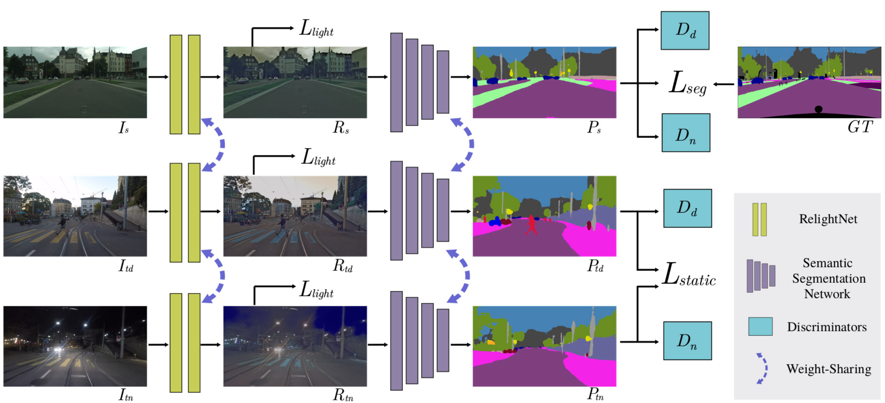
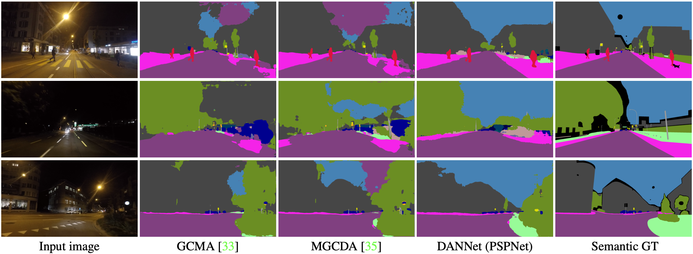

# DANNet: A One-Stage Domain Adaptation Network for Unsupervised Nighttime Semantic Segmentation
CVPR2021(oral) [[arxiv]](https://arxiv.org/abs/2104.10834)

## Requirements
* python3.7
* pytorch==1.5.0
* cuda10.2
## Datasets
**Cityscapes**: Please follow the instructions in [Cityscape](https://www.cityscapes-dataset.com/) to download the training set.

**Dark-Zurich**: Please follow the instructions in [Dark-Zurich](https://www.trace.ethz.ch/publications/2019/GCMA_UIoU/) to download the training/val/test set.
## Testing
If needed, please directly download the visualization results of our method for [Dark-zurich-val](https://www.dropbox.com/s/dq8ahvau9eaxgjc/dannet_PSPNet_val.zip?dl=0) and [Dark-zurich-test](https://www.dropbox.com/s/sph3eiotrc8oxo4/dannet_PSPNet_test.zip?dl=0).

To reproduce the reported results in our paper (on Dark-Zurich val), please follow these steps:
```
Step1: download the [trained models](https://www.dropbox.com/s/fmlq806p2wqf311/trained_models.zip?dl=0) and put it in the root.
Step2: change the data and model paths in configs/test_config.py
Step3: run "python evaluation.py"
Step4: run "python compute_iou.py"
```
If you want to evaluate your methods on the test set, please visit this [challenge](https://competitions.codalab.org/competitions/23553) for more details.
## Training 
If you want to train your own models, please follow these steps:
```
Step1: download the [pre-trained models](https://www.dropbox.com/s/3n1212kxuv82uua/pretrained_models.zip?dl=0) and put it in the root.
Step2: change the data and model paths in configs/train_config.py
Step3: run "python train.py"
```
## Acknowledgments
The code is based on [AdaptSegNet](https://github.com/wasidennis/AdaptSegNet), PSPNet, Deeplab-v2 and RefineNet.
## Related works
* [MGCDA](https://github.com/sakaridis/MGCDA)
* [GCMA](https://www.trace.ethz.ch/publications/2019/GCMA_UIoU/GCMA_UIoU-Sakaridis+Dai+Van_Gool-ICCV_19.pdf)
## Citation
If you think this paper is useful for your research, please cite our paper:
```
@InProceedings{WU_2021_CVPR,
author = {Wu, Xinyi and Wu, Zhenyao and Guo, Hao and Ju, Lili and Wang, Song},
title = {DANNet: A One-Stage Domain Adaptation Network for Unsupervised Nighttime Semantic Segmentation},
booktitle = {IEEE/CVF Conference on Computer Vision and Pattern Recognition (CVPR)},
month = {June},
year = {2021}
}
```
### Contact
* Xinyi Wu (xinyiw@email.sc.edu)
* Zhenyao Wu (zhenyao@email.sc.edu)
